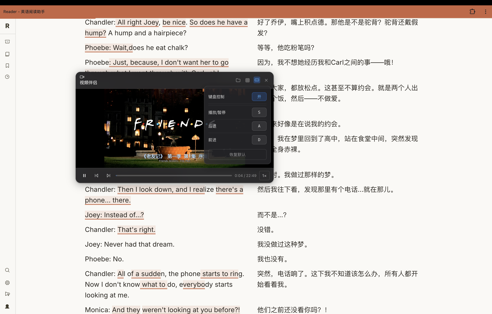
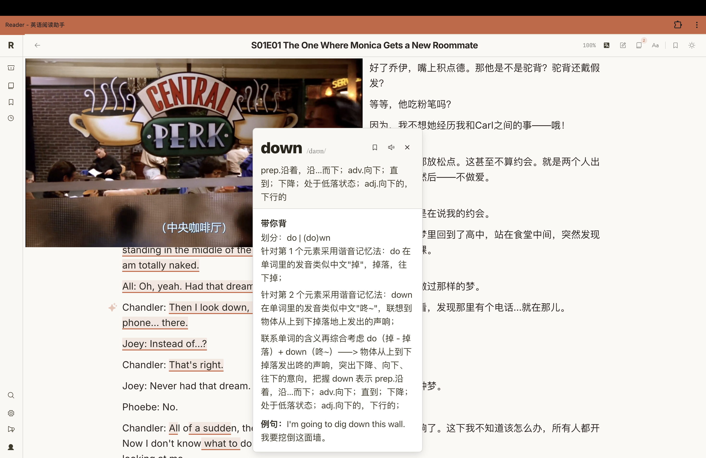

# RVC 视频伴侣

> 专为 [aim-read.top](https://aim-read.top) 双语阅读站设计的本地媒体播放器 Chrome 扩展（v3.2.3）。

在阅读站页面右侧嵌入浮窗播放器，支持 **视频 + 音频**：MKV/MOV/AVI/FLV 等浏览器原生不支持的视频格式通过本地 ffmpeg 服务器实时转码为 MPEG-TS 流式播放，**无文件大小限制**；MP3/M4A/WAV 等音频格式原生直出、零转码。

## 特性

- **实时转码**：MKV/MOV/AVI/FLV 自动转 MPEG-TS 流，边转边播无需等待整文件
- **音频播放**：MP3/M4A/AAC/WAV/FLAC/OGG 原生直出（不经 ffmpeg），倍速/进度/热键全支持
- **无大小限制**：基于本地 ffmpeg，突破浏览器 WASM 内存限制
- **浮动图层**：fixed 图层悬浮在页面上方、不挤压文字，支持拖拽 / 缩放 / 无框模式
- **键盘控制**：S 播放/暂停、A 后退1秒、D 前进1秒（页面内 + 全局热键）
- **目录浏览**：点「浏览」选本地目录，列出所有媒体文件
- **纯本地**：服务器只监听 127.0.0.1，不联网、不上传任何数据

## 截图

**浮动播放器 + 键盘快捷键面板**



**与阅读站单词查询共存** — 点单词弹出释义，直接覆盖在视频上方，互不干扰



## 快速开始

> 本文面向**终端用户**。开发者/维护者请看 [README-内部版.md](README-内部版.md)。

### 方式一：手动下载（推荐）

1. 到 [Releases](../../releases) 下载 `RVC-Video-Companion.zip`
2. 解压
3. 打开「终端」app（Spotlight 搜 Terminal），执行：
   ```bash
   xattr -cr ~/Downloads/RVC-Video-Companion/RVC-Video-Companion.app
   ```
   （路径根据你实际解压位置调整。这一步清除 macOS 隔离标记，跳过验证弹窗，只需做一次；不做也行，双击提示「无法验证开发者」时右键点它 → 打开 → 仍要打开即可）
4. 双击「RVC-Video-Companion.app」启动服务器
5. Chrome 打开 `chrome://extensions` → 开启「开发者模式」→「加载已解压的扩展程序」→ 选解压出的 `reader-video-companion` 文件夹
6. 访问 [aim-read.top](https://aim-read.top)，点扩展图标唤出播放器

### 方式二：让 AI Agent 帮你装

如果你在用 Claude Code / Cursor / Trae / Cline 等 AI 编程助手，把下面这段话**原样复制**发给你的 Agent：

```
帮我安装 RVC 视频伴侣。在终端执行这行命令：
curl -fsSL https://raw.githubusercontent.com/wql18902-ux/rvc-video-companion/main/packaging/install.sh | bash

装完后帮我加载 Chrome 扩展：
1. 打开 chrome://extensions → 开启「开发者模式」
2. 点「加载已解压的扩展程序」→ 选 ~/Applications/RVC-Video-Companion/reader-video-companion
3. 打开 https://aim-read.top 点扩展图标验证能用

任何一步失败就停下来告诉我具体错误。
```

### 方式三：一行命令安装（开发者/海外网络可选）

> curl 下载走 GitHub，国内网络可能较慢或超时。国内用户推荐方式一。

打开「终端」app，粘贴下面这行命令后回车：

**打包版**（无需装 Python/ffmpeg，适合所有人）：

```bash
curl -fsSL https://raw.githubusercontent.com/wql18902-ux/rvc-video-companion/main/packaging/install.sh | bash
```

**源代码版**（需要 Homebrew，适合开发者）：

```bash
curl -fsSL https://raw.githubusercontent.com/wql18902-ux/rvc-video-companion/main/packaging/install-source.sh | bash
```

> 为什么用 curl？macOS 只对浏览器下载的文件打「隔离标记」，curl 下载的文件不会被 Gatekeeper 拦截，双击即用。

安装完成后按提示加载 Chrome 扩展即可使用。

### 方式四：从源码运行（开发者）

```bash
# 启服务器（端口 8765）
bash stream-server/start.sh

# 加载扩展：chrome://extensions → 开发者模式 → 加载已解压 → reader-video-companion/

# 跑验收
rm -rf /tmp/rvc-pw-profile-accept
env -u PYTHONHOME -u PYTHONPATH python3 tests/acceptance.py
```

**前置依赖**：Python 3.10+、ffmpeg、ffprobe、pynput（全局热键；缺失时仅热键失效，服务器其余功能正常）

> 源码版服务器仅用 Python 标准库（`http.server`），无需 pip 安装任何包；pynput 为全局热键可选依赖。

## 首次使用权限授权（macOS）

| 权限 | 用途 | 不授权影响 |
|------|------|-----------|
| 输入监控 | 全局热键 S/A/D | 仅全局热键失效，其余功能正常 |

> 选目录走 macOS 原生「选取文件夹」对话框（纯 AppleScript `choose folder`，无需 Finder 激活、无需自动化权限）。
> 每次更新 .app 后，输入监控权限会失效（系统按签名记账），需重新勾选。

## 支持的媒体格式

| 类型 | 格式 | 处理方式 |
|------|------|----------|
| 视频 | MP4/M4V/WebM | 浏览器直接播放 |
| 视频 | MKV/MOV/AVI/FLV | ffmpeg 实时转 MPEG-TS 流 |
| 音频 | MP3/M4A/AAC/WAV/FLAC/OGG | 浏览器原生播放（零转码） |

## 隐私

所有视频只在你的电脑本地处理。服务器只监听 `127.0.0.1`，不联网、不上传任何数据。

## 系统要求

- macOS 12+
- Chrome / Edge / 其他 Chromium 浏览器

## 开发者参考

### 技术栈

- **Chrome 扩展（MV3）**：Vanilla JS，无构建工具链
- **本地服务器**：Python 3 标准库 `http.server`（BaseHTTPRequestHandler）+ ffmpeg/ffprobe
- **流式播放**：mpegts.js（浏览器端 MPEG-TS 解码）
- **打包分发**：PyInstaller 打包 .app（含 ffmpeg 二进制，用户无需装 Python/ffmpeg）

### 目录结构

```
.
├── reader-video-companion/   # Chrome 扩展（唯一维护的扩展）
│   ├── content.js            # 内容脚本（播放器主体逻辑）
│   ├── player.css            # 播放器样式
│   ├── background.js         # 后台脚本（消息中转）
│   ├── manifest.json         # MV3 清单（版本号唯一源）
│   └── mpegts.min.js         # MPEG-TS 解码库
├── stream-server/            # 本地转码服务器
│   ├── server.py             # 本地服务器（http.server，含 SSE 热键通道）
│   ├── start.sh              # 启动脚本
│   └── packaging/            # .app 打包脚本
│       └── build.sh          # PyInstaller 打包 .app
├── packaging/                # 分发包打包脚本
│   ├── make-distro.sh        # 生成分发包 zip
│   ├── install.sh            # 一键安装（打包版）
│   └── install-source.sh     # 一键安装（源码版）
├── tests/                    # 测试脚本
│   ├── acceptance.py         # 端到端验收（sha256 冻结）
│   ├── test_server_api.py    # L1 单测（37 用例）
│   ├── e2e_extra.py          # L2 真实进程 E2E（8 用例）
│   └── fixtures/             # 测试样本
├── scripts/                  # 检查脚本
│   ├── check.sh              # 统一检查（静态 + 验收）
│   └── install-hooks.sh      # git hooks 安装
├── run_tests.sh              # 分层测试入口（L0→L1→L2→汇总）
└── test.html                 # 验收测试页（sha256 冻结）
```

## License

MIT

## 致谢

- [mpegts.js](https://github.com/xqq/mpegts.js) — MPEG-TS 解码
- [ffmpeg](https://ffmpeg.org/) — 视频转码
